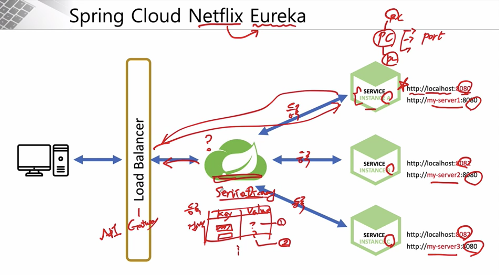

## 섹션 1. Service Discovery

### Service Discovery

- 어떤 MSA 서비스가 어디에 위치해있는지 등록, 검색 등의 작업해주는 서비스
- netflix eureka 등이 존재

 

Eureka Project 생성 

Dependency : eureka server 

pom.xml : maven project의 설정 파일

external libraries : dependency lib 표시

### Eureka Service Discovery - 프로젝트 생성

Spring Project 생성 방법 

- Intellij
- [start.spring.io](http://start.spring.io)

Packaging Type 

1. Jar (Java Archive)
2. War (Web Application Archive) 
- **| JAR ( Java Archive )**
    
    **.jar** 확장자 파일에는 Class와 같은 Java 리소스와 속성 파일,  라이브러리 및 액세서리 파일이 포함되어 있습니다.
    
    쉽게 JAVA 어플리케이션이 동작할 수 있도록 **자바 프로젝트를 압축한 파일**로 생각하시면 되겠네요. 실제로 **JAR 파일은 플랫폼에 귀속되는 점만 제외하면 WIN ZIP파일과 동일한 구조**입니다.
    
    JAR 파일은 **원하는 구조로 구성이 가능**하며 JDK(Java Development Kit)에 포함하고 있는 **JRE(Java Runtime Environment)만 가지고도 실행이 가능**합니다.
    
    ****|**** 
    **WAR ( Web Application Archive )**
    
    **.war** 확장자 파일은  servlet / jsp 컨테이너에 배치 할 수 있는 **웹 어플리케이션(Web Application) 압축 파일 포맷**입니다.  JSP,  SERVLET, JAR, CLASS, XML, HTML, JAVASCRIPT 등  Servlet Context 관련 파일들로 패키징 되어있습니다. WAR는 웹 응용 프로그램를 위한 포맷이기 때문에 **웹 관련 자원만 포함하고 있으며 이를 사용하면 웹 어플리케이션을 쉽게 배포**하고 테스트 할 수 있습니다.
    
    원하는 구성을 할 수 있는 JAR 포맷과 달리 WAR은 WEB-INF 및 META-INF 디렉토리로 **사전 정의 된 구조를 사용**하며 **WAR파일을 실행하려면 Tomcat, Weblogic, Websphere 등의 웹 서버 (WEB)또는 웹 컨테이너(WAS)가 필요**합니다.
    
    **WAR 파일도 JAVA의 JAR 옵션( java - jar)을 이용해 생성하는 JAR파일의 일종**으로 웹어플리케이션 전체를 패키징하기 위한 JAR파일로 생각하시면 될 것 같습니다.
    
    출처: [https://ifuwanna.tistory.com/224](https://ifuwanna.tistory.com/224)
    

Intellij에서 프로젝트 오픈시 모습 

### UserService (Client) 생성

- Eureka Discovery Client Dependency 필수

DiscoveryClient를 구현하여 상품화시켜놓은 것이 EurekaClient 

register-with-eureka : eureka에 해당 client 등록 

fetch-registry : eureka 서버로부터 인스턴스들의 정보 주기적으로 가져올 것인지 설정

service-url : 서버의 위치값 등록 

application 실행 (run) 하면 target 폴더 생성됨 

eureka server 페이지에서 application 추가된 것을 확인 할 수 있음

Intellij에서 configuration 설정가능 ( service 복제 및 parameter 설정 가능 ) 

Eureka service directory 안에 User-Service 두 서비스가 실행 중인 것을 확인할 수 있다.

Maven Lifecycle

[https://m.blog.naver.com/PostView.naver?isHttpsRedirect=true&blogId=remagine&logNo=220726121992](https://m.blog.naver.com/PostView.naver?isHttpsRedirect=true&blogId=remagine&logNo=220726121992)

설치된 maven을 바탕으로 커맨드라인으로 spring prj 실행 가능 

compile package된 jar file을 직접 실행 가능

random port 

instance id로 각 service 구분 

