## 섹션 5. Catalogs and Orders Microservice

### Users Microservice - 사용자 조회 ①

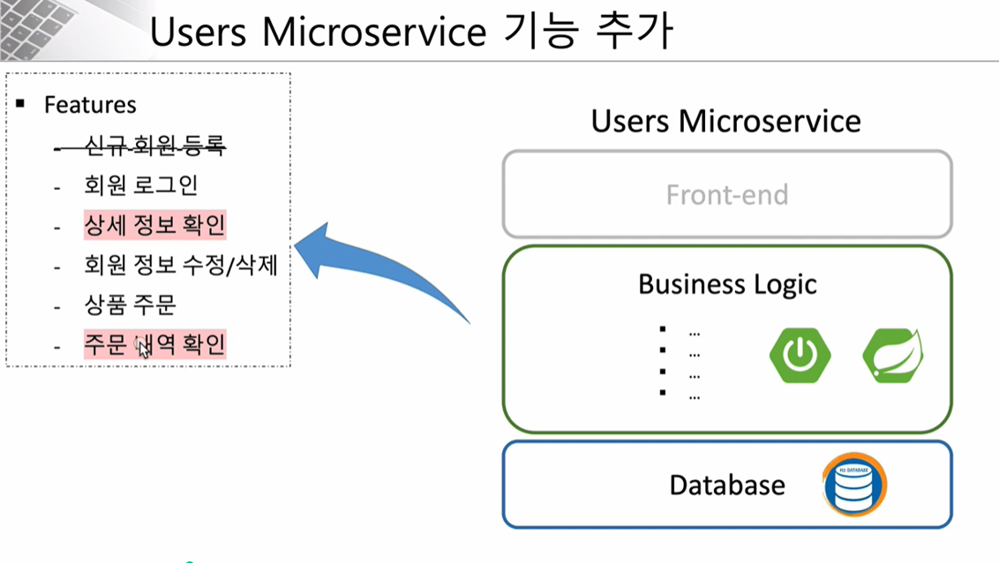
- 이번 섹션에서는 상세 정보 확인과 주문 내역 확인 기능을 구현
- REST API 방식을 이용하고, front-end는 구현하지 않음 
- JSON data 형식으로 요청과 응답을 받음
- Business Logic을 만들기 위해서 Spring Boot와 Spring Cloud를 사용
- H2 내장 DB 사용

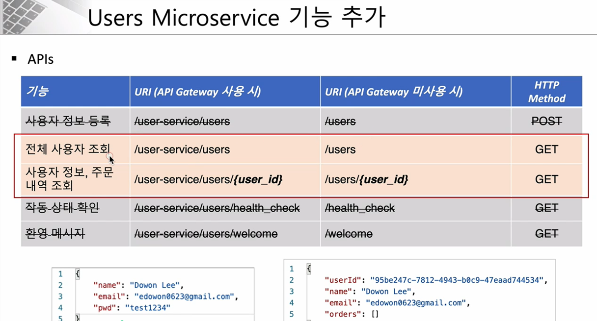
- 사용자 정보 등록을 위한 URI와 전체 사용자 조회를 위한 URI가 일치
- HTTP 메서드 방식을 다르게(POST, GET) 구분하여 하나의 URI를 가지고 다양한 기능을 할 수 있음
- REST API 성숙도 모델의 레벨 2에 해당
- 왼쪽은 사용자가 회원가입할 때 등록했던 JSON 데이터 포맷을 회원가입이 성공했을 때 받게 되는 응답이고 오른쪽은 사용자 정보, 주문 내역 조회를 하는 API를 요청했을 때 응답받게 되는 결과

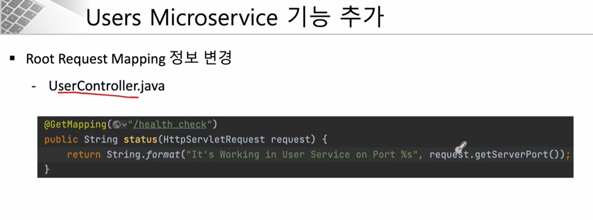
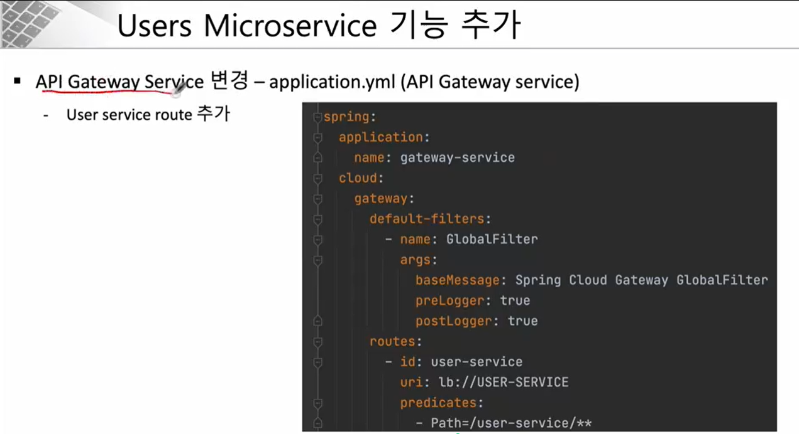
- api-gateway 서비스와 user-service 연동하기 위해 application.yml 파일에 user service route 추가 
- 지금까지는 Eureka 서비스를 통해 random port를 이용해 접근해야 했는데, 중간에 api-gateway 서비스의 USER-SERVICE는 eureka 서비스에 등록되어있는 서비스 id Predicates에 적힌 url로 요청을 하면 EUREKA에 USER-SERVICE라는 이름으로 등록된 서비스로 포워딩

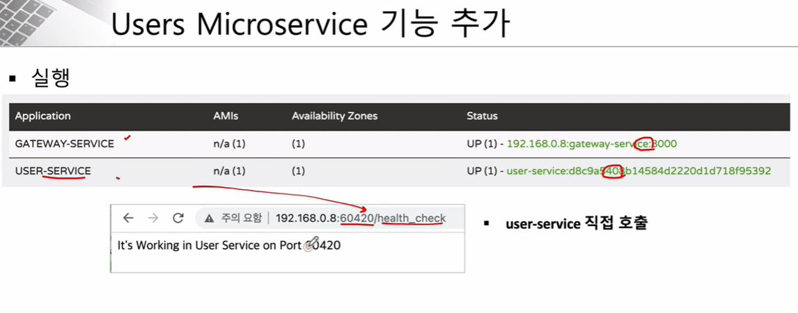
- 아래 그림의 포트는 gateway를 거치지 않고 직접 user-service를 접속했을 때 이전 시간에 만들었던 health_check 메서드가 잘 동작하는지 확인했던 화면

### Users Microservice와 Spring Cloud Gateway 연동
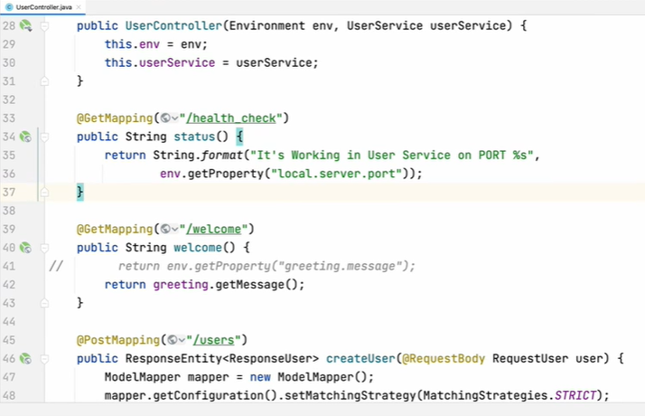
- UserController에 health_check 메서드를 변경하여 포트 번호를 확인할 수 있도록 구현 
- Enviroment라는 객체를 주입받고 있기 때문에 바로 사용 가능 
- application.yml 파일에 port를 랜덤으로 할당받도록 설정했기 때문에 이 uri로 실제 동작하는 포트 번호를 확인 가능

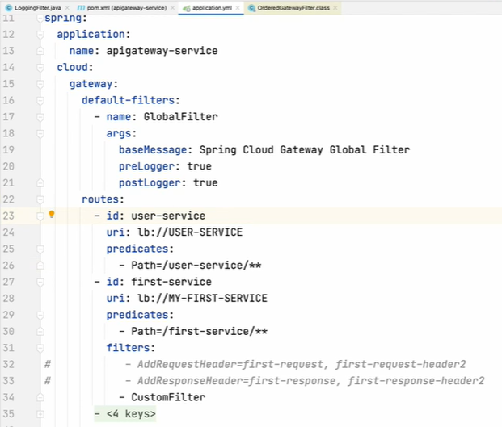
- api gateway routes 정보에 user-service를 등록
- 로드밸런서에 등록된 이름으로 uri에 등록
- predicates는 조건식으로 클라이언트가 user-service로 시작하는 요청을 보낼때 uri로 포워드함

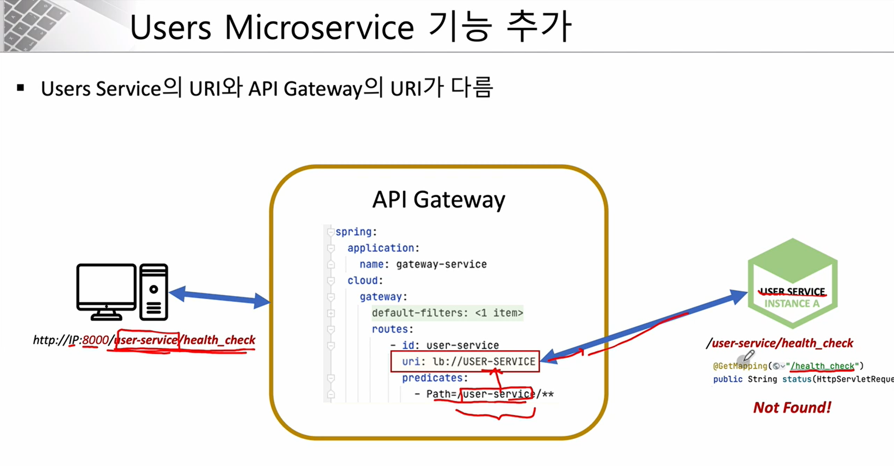
- 기존과 같이 port 번호를 통해 직접 health_check 요청을 보내면 정상 작동하지만 api-gateway를 통해 접근하면 404 not found 에러가 발생
- 그 이유는 api-gateway에서 user-service로 요청을 전달할 때 /user-service/health_check 요청의 prefix인 user-service까지 포함하여 그대로 전달하는데, UserController에서 그것을 매핑해줄 메서드가 없기 때문에 문제가 발생
- user-service를 직접 호출할 때에도 정상적으로 동작하기 위해서 직접 호출할 때에도 /user-service를 붙여서 요청


### Users Microservice - 사용자 조회 ②
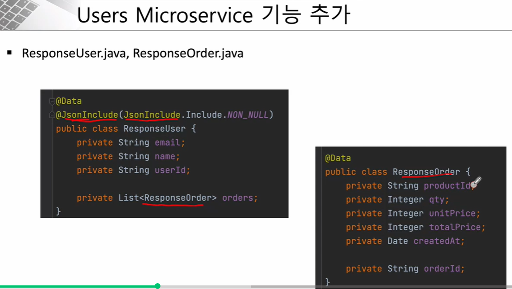
- ResponseUser와 ResponseOrder 클래스를 추가
- JSON으로 전달받는 데이터 중에 null로 채워져서 불필요한 경우 받아오지 않기 위해 @JsonInclude라는 어노테이션을 사용


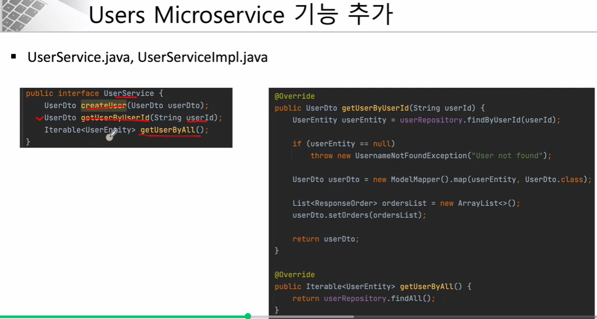
- CrudRepository를 상속받기 때문에 userRepository에서 findByUserId메서드를 정의만 해주면 select문의 where조건으로 userId를 조회하는 것과 같은 결과
- ModelMapper를 사용하여 userEntity를 UserDto로 변환


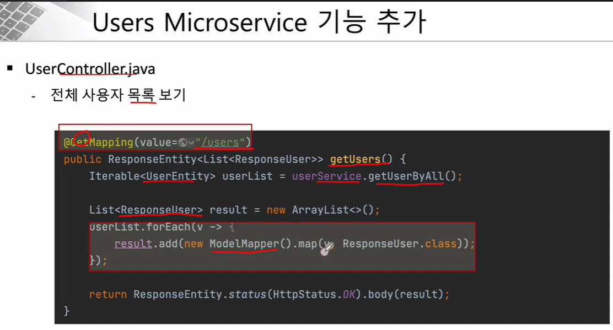
- DB에서 조회한 값을 그대로 사용자에게 전달하기 보다는, 조회한 결과 중에서 가공이 필요하거나 필요한 데이터만 전달할 수 있도록 ModelMapper를 통해 ResponseUser 클래스로 변환하고 리턴

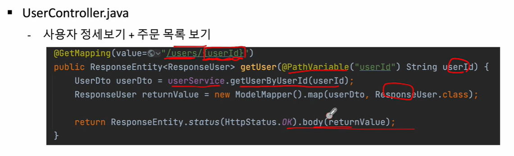
- 매개변수로 userId를 받고 getUserByUserId에서 조회한 결과는 responseUser 클래스의 객체이기 때문에 이것을 다시 userDto로 받고 이것을 다시 ModelMapper를 통해 responseUser로 변환

#### Path variable과 Query parameter의 적절한 사용
- 일반적으로 /users/{userid}와 같이 리소스를 식별해야하는 경우는 path variable을 사용하고, /products?category=top과 같이 정렬 또는 필터 등의 조건을 사용하고 싶은 경우는 query parameter를 사용.
- path variable로 요청한 경로에 해당하는 페이지가 없으면 404 에러를 발생시킴.
- query parameter는 서버로 데이터가 넘어가고, 쿼리를 실행한 결과 조회된 데이터가 리턴되기 때문에 리턴 결과가 없을 경우 에러 핸들링이 필요.


### Users Microservice - 사용자 조회 ③


- findAll 메서드는 jpa를 사용하기 때문에 기본적으로 제공되지만, findByUserId는 직접 작성 필요
- UsernameNotFoundException은 Springframework.security 패키지 안에 있는 클래스이고, 지금 상황에 완전히 적합하지는 이런 식으로 error를 throw해주면 된다는 느낌으로 강사님이 사용하셨음.

- UserServiceImpl.java

getUserByAll 메서드처럼 DB에서 응답받은 데이터인 UserEntity를 전혀 가공할 필요가 없다면 그대로 UserEntity로 반환해도 괜찮음.

```java
@Override
public UserDto getUserByUserId(String userId) {
    UserEntity userEntity = userRepository.findByUserId(userId);

    if (userEntity == null) {
        // Springframework.security
        throw new UsernameNotFoundException("User not found");
    }

    UserDto userDto = new ModelMapper().map(userEntity, UserDto.class);

    List<ResponseOrder> ordersList = new ArrayList<>();
    userDto.setOrders(ordersList);

    return userDto;
}

@Override
public Iterable<UserEntity> getUserByAll() {
    // jpa에서 제공해주는 CrudRepository 인터페이스를 상속하기 때문에 기본적으로 제공
    return userRepository.findAll();
}
```

- UserController.java
```java
@GetMapping(value = "/users")
public ResponseEntity<List<ResponseUser>> getUsers() {
    Iterable<UserEntity> userList = userService.getUserByAll();

    List<ResponseUser> result = new ArrayList<>();
    userList.forEach(v -> {
        result.add(new ModelMapper().map(v, ResponseUser.class));
    });

    return ResponseEntity.status(HttpStatus.OK).body(result);
}

@GetMapping(value = "/users/{userId}")
public ResponseEntity<ResponseUser> getUser(@PathVariable("userId") String userId) {
    UserDto userDto = userService.getUserByUserId(userId);
    ResponseUser returnValue = new ModelMapper().map(userDto, ResponseUser.class);

    return ResponseEntity.status(HttpStatus.OK).body(returnValue);
}
```

### Catalogs Microservice - 개요
- 상품 목록 조회를 위한 서비스

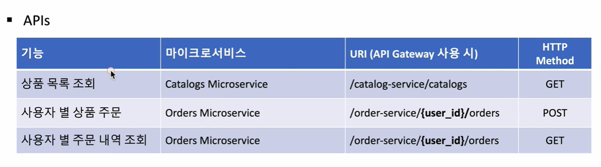

- 상품 자동 등록

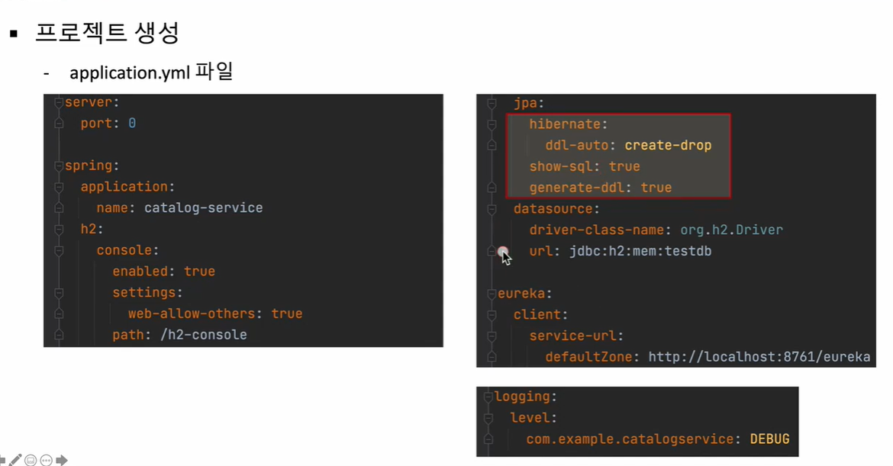

- ddl auto 속성을 create-drop으로 설정하면 실행할 때 필요한 데이터를 생성하는 로직을 sql 파일에 등록하게 되고, 해당 데이터파일을 자동으로 insert해서 처음부터 상품이 등록됨

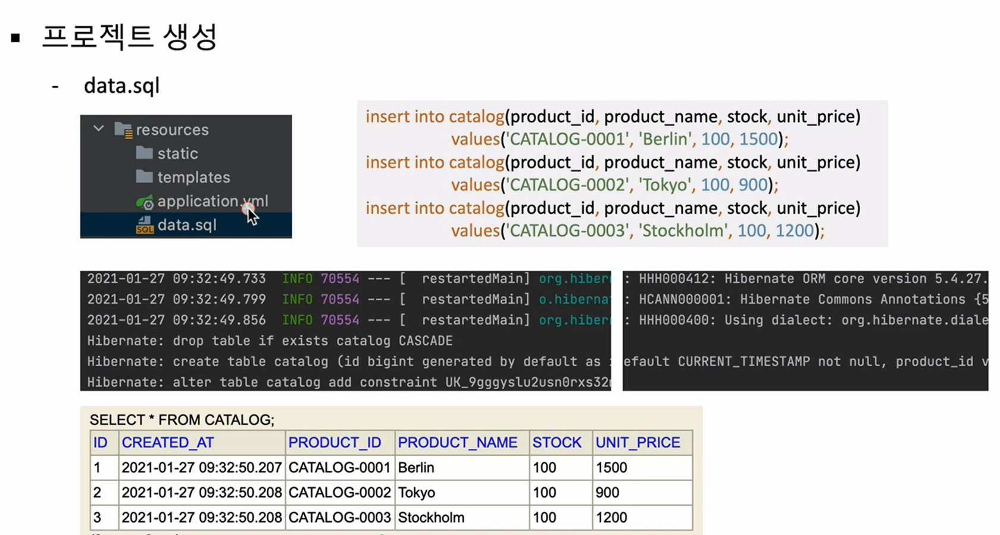


### Catalogs Microservice - 기능 구현 ①

- CatalogEntity.java

```java
@Data
@Entity
@Table(name = "catalog")
public class CatalogEntity implements Serializable {
    // 유일한 값으로 생성
    @Id
    @GeneratedValue(strategy = GenerationType.IDENTITY)
    private Long id;

    @Column(nullable = false, length = 120, unique = true)
    private String productId;
    
    @Column(nullable = false)
    private String productName;
    
    @Column(nullable = false)
    private Integer stock;
    
    @Column(nullable = false)
    private Integer unitPrice;

    // 사용자가 변경하거나 직접 입력할 수 없고 현재 날짜를 자동으로 입력하도록 하기 위해
    // 현재 날짜를 가져오기 위한 H2 DB의 함수를 호출하는 방법
    @Column(nullable = false, updatable = false, insertable = false)
    @ColumnDefault(value = "CURRENT_TIMESTAMP")
    private Date createdAt;
}

```
#### Serializable
- Serializable은 직렬화를 해주는 인터페이스, 직렬화가 가능한 클래스를 만들고 싶으면 인터페이스롤 구현
- 직렬화란 객체를 데이터 스트림으로 만드는 것. 객체에 저장된 데이터를 스트림에 쓰기 위해 연속적인 데이터로 변환하는 것.
- 객체를 네트워크를 통해 전송하거나 데이터베이스에 보관하거나, 변화시키기 위해서 바이트 배열의 형태로 변경해주는 Marshalling, Unmarshalling 작업
- UserEntity 같은 클래스에서도 작업을 해주는 게 좋음


##### 참고)
- 직렬화(스트림에 객체를 출력)에는 ObjectOutputStream을 사용하고 역직렬화(스트림으로부터 객체에 입력)에는 ObjectInputStream을 사용


- ResponseCatalog.java

null 값을 반환시키지 않기 위해서 @JsonInclude를 사용
```java
@Data
@JsonInclude(JsonInclude.Include.NON_NULL)
public class ResponseCatalog {
    private String productId;
    private String productName;
    private Integer unitPrice;
    private Integer totalPrice;
    private Integer stock;
    private Date createdAt;
}
```


### Catalogs Microservice - 기능 구현 ②

- CatalogController.java

```java
@RestController
@RequestMapping("/catalog-service")
public class CatalogController {
    Environment env;
    CatalogService catalogService;

    @Autowired
    public CatalogController(Environment env, CatalogService catalogService) {
        this.env = env;
        this.catalogService = catalogService;
    }

    @GetMapping("/health_check")
    public String status() {
        return String.format("It's Working in Catalog Service on PORT %s", env.getProperty("local.server.port"));
    }

    @GetMapping(value = "/catalogs")
    public ResponseEntity<List<ResponseCatalog>> getCatalogs() {
        Iterable<CatalogEntity> catalogList = catalogService.getAllCatalogs();

        List<ResponseCatalog> result = new ArrayList<>();
        catalogList.forEach(v -> {
            result.add(new ModelMapper().map(v, ResponseCatalog.class));
        });

        return ResponseEntity.status(HttpStatus.OK).body(result);
    }
}
```

### Orders Microservice - 개요
- 사용자별 주문과 주문 내역 조회


- Project 생성시에 필요한 dependencies 등은 이전과 동일
- 실행할 때마다 DB 갱신되도록 설정하기 위해 application.yml에 jpa 속성만 변경

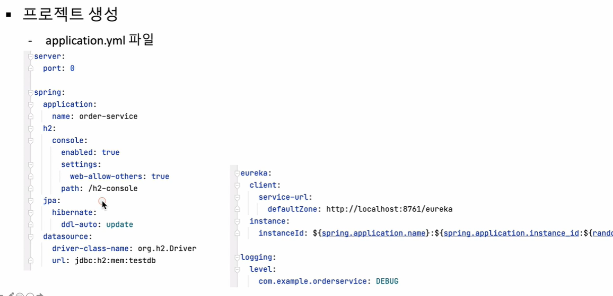


### Orders Microservice - 기능 구현 ①

- OrderServiceImpl.java

```java
@Service
public class OrderServiceImpl implements OrderService {
    OrderRepository orderRepository;

    @Autowired
    public OrderServiceImpl(OrderRepository orderRepository) {
        this.orderRepository = orderRepository;
    }

    @Override
    public OrderDto createOrder(OrderDto orderDto) {
        orderDto.setOrderId(UUID.randomUUID().toString());
        orderDto.setTotalPrice(orderDto.getQty() * orderDto.getUnitPrice());

        ModelMapper mapper = new ModelMapper();
        mapper.getConfiguration().setMatchingStrategy(MatchingStrategies.STRICT);
        OrderEntity orderEntity = mapper.map(orderDto, OrderEntity.class);

        orderRepository.save(orderEntity);

        OrderDto returnValue = mapper.map(orderEntity, OrderDto.class);
        return returnValue;
    }

    @Override
    public OrderDto getOrderByOrderId(String orderId) {
        OrderEntity orderEntity = orderRepository.findByOrderId(orderId);
        OrderDto orderDto = new ModelMapper().map(orderEntity, OrderDto.class);
        return orderDto;
    }

    @Override
    public Iterable<OrderEntity> getOrdersByUserId(String userId) {
        return orderRepository.findByUserId(userId);
    }
}
```


### Orders Microservice - 기능 구현 ②


- OrderController.java

```java
@RestController
@RequestMapping("/order-service/")
public class OrderController {
    Environment env;
    OrderService orderService;

    @Autowired
    public OrderController(Environment env, OrderService orderService) {
        this.env = env;
        this.orderService = orderService;
    }

    @GetMapping("/health_check")
    public String status() {
        return String.format("It's Working in Order Service on PORT %s", env.getProperty("local.server.port"));
    }

    // POST http://127.0.0.1:8000/order-service/{user_id}/orders/
    @PostMapping(value = "/{userId}/orders")
    public ResponseEntity<ResponseOrder> createOrder(@PathVariable("userId") String userId, @RequestBody RequestOrder orderDetails) {
        ModelMapper mapper = new ModelMapper();
        mapper.getConfiguration().setMatchingStrategy(MatchingStrategies.STRICT);

        OrderDto orderDto = mapper.map(orderDetails, OrderDto.class);
        orderDto.setUserId(userId);
        OrderDto createdOrder = orderService.createOrder(orderDto);

        ResponseOrder responseOrder = mapper.map(createdOrder, ResponseOrder.class);

        return ResponseEntity.status(HttpStatus.CREATED).body(responseOrder);
    }

    // GET http://127.0.0.1:8000/order-service/{user_id}/orders/
    @GetMapping(value = "/{userId}/orders")
    public ResponseEntity<List<ResponseOrder>> getOrder(@PathVariable("userId") String userId) {
        Iterable<OrderEntity> orderList = orderService.getOrdersByUserId(userId);

        List<ResponseOrder> result = new ArrayList<>();
        orderList.forEach(v -> {
            result.add(new ModelMapper().map(v, ResponseOrder.class));
        });

        return ResponseEntity.status(HttpStatus.OK).body(result);
    }
}
```