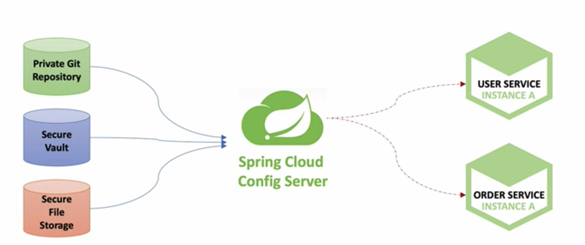

# Spring Cloud로 개발하는 마이크로 서비스 (CoP) - 섹션7

## 섹션7의 주요 내용

- [Spring Cloud Config](#spring-cloud-config란)
- [Local Git Repository](#spring-cloud-config란)
- [Microservice에 적용](#microservice에-적용-user-service--spring-cloud-gateway)
- [Spring Boot Actuator](#spring-boot-actuator-설정)
- [Profiles 적용 (개발,테스트,운영 환경에 맞춰서 구성정보 변경하여 적용)](#profiles을-사용한-configuration-적용)
- [Remote Git Repository](#remote-git-repository)
- [Native File Repository](#native-file-repository)

### Spring Cloud Config란?

- 분산 시스템에서 서버/클라이언트 **구성에 필요한 설정 정보(application.yml)를 외부 시스템에서 관리**
- 하나의 **중앙화 된 저장소**에서 구성요소 관리 가능
- 각 서비스를 **다시 빌드하지 않고, 바로 적용 가능**
- **배포 파이프라인**을 통해 DEV-UAT-PROD 환경에 맞는 구성 정보 사용 (DB, IP address, value..)
- 외부 시스템은 private한 git repository, 보안된 보관소 파일 시스템 등이 사용됨



### Local Git Repository를 사용하여 구성정보 관리

- 구성정보파일(ecommerce.yml) 내용


- yaml 파일 생성 및 관리

```bash
mkdir git-local-repo
cd git-local-repo
git init 
vi ecommerce.yml #설정 파일 생성
git add ecommerce.yml   #git 추적파일로 등록
git commit -m "Upload an application yaml file" 
# push:remote repository(server)에 업로드
# commit:local repository에 등록. local에서도 git을 이용하여 형상관리, 소스관리, 추적관리 가능
```


### Spring Cloud Config Server 생성, 설정

1. Config Server Project 생성 


2. Dependencies 추가


3. [ConfigServiceApplication.java](http://ConfigServiceApplication.java) 파일 수정 


4. project 내 applicaiton.yml 파일 수정 


5. 프로젝트 실행 후 웹 브라우저로 profile별 구성정보파일 확인 가능 


### Microservice에 적용 (User Service / Spring Cloud Gateway)

1. Dependency 추가


2. bootstrap.yml 추가 
    1. 서비스 내에서 읽어오고자하는 configuration 정보의 위치를 지정
    2. applicaton.yml 보다 이르게 정보를 불러와 주기 때문에 가장 먼저 적용 가능
        
        
        


3. application.yml  파일에 token 정보 삭제


4. 웹 브라우저에서 구성정보 확인 가능

```java
@GetMapping("/health_check")
public String status() {
	return String.format("It's Working in User Service"
					+ ", port(local.server.port)=" + env.getProperty("local.server.port")
					+ ", port(server.port)=" + env.getProperty("server.port")
					+ ", token secret=" + env.getProperty("token.secret")
					+ ", token expiration time=" + env.getProperty("token.expiration.time"));
}
```


5. ecommerce.yml 파일 변경 후 새로운 value 반영되는지 서비스 리부팅


- 💡 configuration values 변경하는 다양한 방법
    - 서버 재기동
    - Actuator refresh : spring boot actuator의  refresh 기능 사용
        - [Spring Boot Actuator](https://docs.spring.io/spring-boot/docs/current/reference/htmlsingle/#actuator) : Application 상태, 모니터링. Metric 수집을 위한 Http End Point 제공
    - Spring cloud bus 사용 : actuator 방법보다 효율적으로 사용 가능
    

### [Spring Boot Actuator](https://docs.spring.io/spring-boot/docs/current/reference/htmlsingle/#actuator) 설정

1. Dependency 추가


2. 인증/인가 관련 예외 처리 추가 
- User Service
    - [WebSecurity.java](http://WebSecurity.java)의  config method 로직 변경
    - 별도 인증/인가 권한 처리 없이 접근할 수 있도록 설정


- Spring Cloud Gateway
    - user-service/actuator/** path 추가


3. applicatoin.yml 파일에 포함시키고자하는 EndPoint 명시


| beans | applcation context에 포함된 bean들의 정보 학인 가능 |
| --- | --- |
| health | service의 현 상태 확인 가능 |
| refresh |  POST방식으로 API 호출하면  구성정보설정파일  refresh 해줌 |
| httptrace | client 요청이 들어왔을 때 타 서비스들이 호출 확인 가능 ( spring cloud gateway에서 사용)
추가로 HttpTraceRepository를 bean으로 등록해주어야 사용 가능  |

### **Profiles을 사용한 Configuration 적용**

- Multiple Environments


1. config yaml file을 profile별로 생성 (profile별로 value 값 변경)


 


2. 각 서비스 bootstrap.yml 파일에 active profile 지정 
    1. bootstrap.yml 파일에 active profile을 지정하게 되면 해당 환경에서 서비스를 기동하겠다는 의미. 따라서 해당 환경에 맞는 application.yml 파일을 읽어오게 된다. (없으면 default yaml file)
    2. intellij 내에서도 active profile 지정 후 서비스 기동 가능 ( + java command, application.yml 파일로도 가능)

<aside>
✅ user service는 dev로 지정

</aside>


<aside>
✅ api gate way service는 prod로 지정

</aside>


### Remote Git Repository

remote git repository 구성정보 데이터 연동

1. remote repository 생성 및 로컬에 해당 repo add / push

```bash
git remote add origin https://github.com/sophysophysophysophy/spring-cloud-config.git
git push --set-upsteam origin master  # 최초 push일 경우 --set-upstream 
```


2. config server service에 uri를 remote 레포 주소로 변경 


### Native File Repository

- 물리적인 파일로 config 정보 구성
- config server service application.yml 파일에 native 경로 지정


